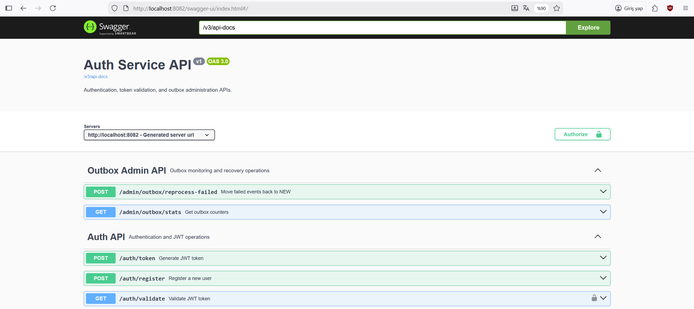
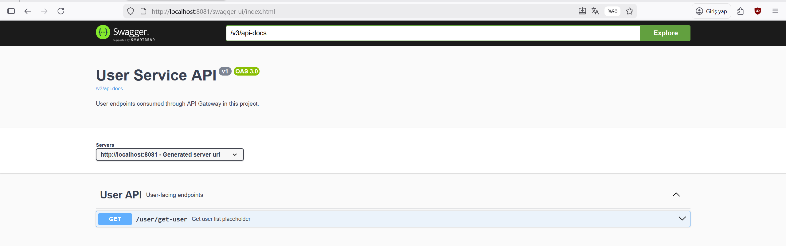
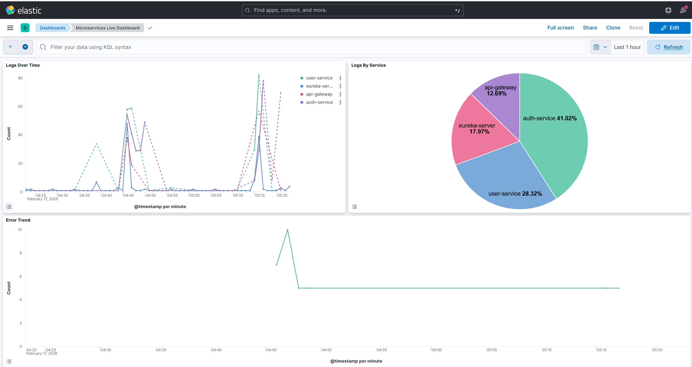
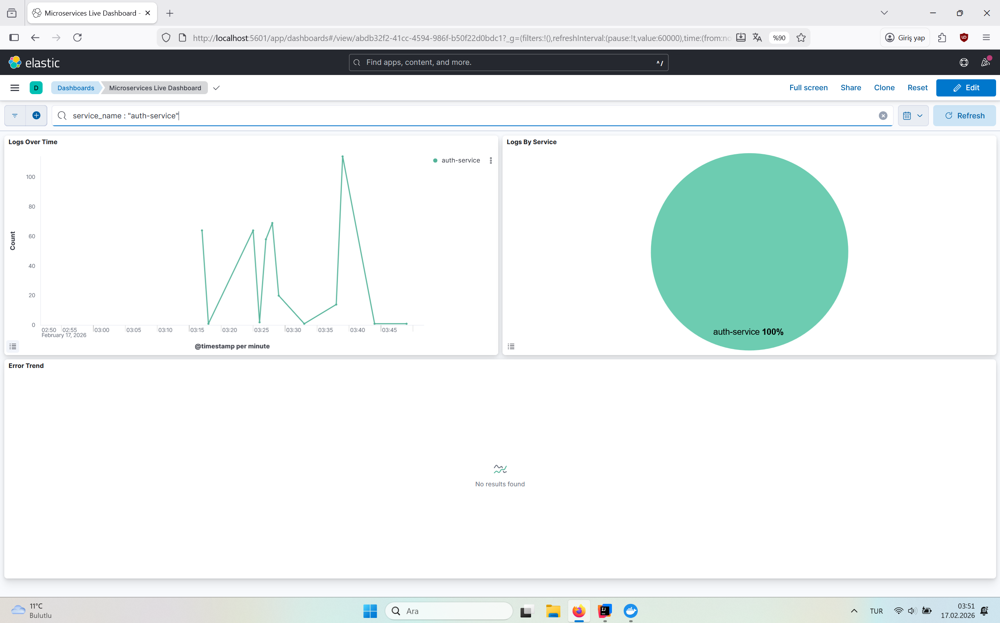
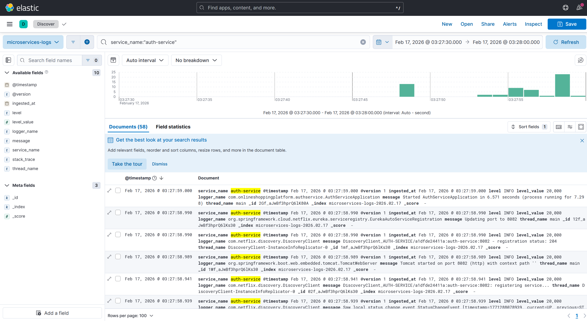
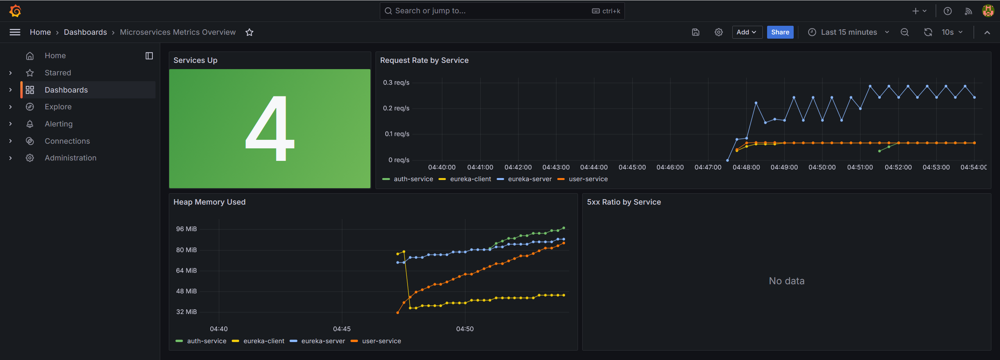
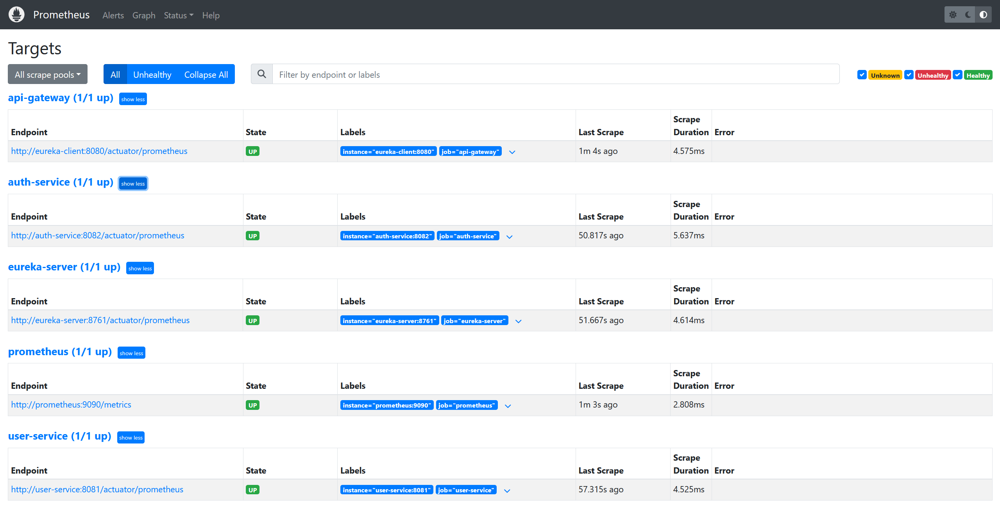

# ELK Microservice Log Application

<p align="left">
  <a href="https://www.java.com/" title="Java"></a>
  <a href="https://spring.io/projects/spring-boot" title="Spring Boot"></a>
  <a href="https://kafka.apache.org/" title="Kafka"></a>
  <a href="https://www.postgresql.org/" title="PostgreSQL"></a>
  <a href="https://www.elastic.co/elasticsearch" title="Elasticsearch"></a>
  <a href="https://www.elastic.co/kibana" title="Kibana"></a>
  <a href="https://prometheus.io/" title="Prometheus"></a>
  <a href="https://grafana.com/" title="Grafana"></a>
  <a href="https://www.docker.com/" title="Docker"></a>
  <a href="https://maven.apache.org/" title="Maven"></a>
</p>

This is a Spring Boot microservices playground that combines event-driven communication and observability in a single project.

- Log observability: ELK (Elasticsearch + Logstash + Kibana)
- Metrics observability: Prometheus + Grafana
- Service discovery and gateway: Eureka Server + Spring Cloud Gateway

## Architecture

### Microservices

- `eureka-server` (`8761`): Service registry
- `eureka-client` (`8080`): API Gateway
- `auth-service` (`8082`): Registration, token generation, token validation, outbox admin endpoints
- `user-service` (`8081`): User endpoint and Kafka consumer
- `event-contract`: Shared event model (`UserRegisteredEvent`)

### Infrastructure (Docker)

- PostgreSQL (`5432`)
- Zookeeper (`2181`)
- Kafka (`9092`, `29092`)
- Elasticsearch (`9200`)
- Logstash (`5000`, `9600`)
- Kibana (`5601`)
- Prometheus (`9090`)
- Grafana (`3000`)

## Event-Driven Flow

1. `POST /auth/register` creates a user in `auth-service`.
2. `auth-service` writes a registration event to the outbox table.
3. Outbox publisher sends the event to Kafka topic `user.registered.v1`.
4. `user-service` consumes the event.
5. Consumer applies retry, DLT, and idempotency logic.

Outbox admin endpoints:

- `GET /admin/outbox/stats`
- `POST /admin/outbox/reprocess-failed?limit=100`

## Prerequisites

- Docker Desktop
- Docker Compose
- (Optional) Java 21 + Maven for local non-Docker runs

## Setup

1. Create `.env` from template:

```bash
cp .env.example .env
```

2. At minimum, set these values in `.env`:

- `POSTGRES_PASSWORD`
- `AUTH_DB_PASSWORD`
- `AUTH_JWT_SECRET_B64`
- `GRAFANA_ADMIN_USER`
- `GRAFANA_ADMIN_PASSWORD`

3. Start the full stack:

```bash
docker compose --env-file .env up -d --build
```

4. Check container status:

```bash
docker compose ps
```

## Service URLs

- Eureka: `http://localhost:8761`
- Gateway: `http://localhost:8080`
- Auth Service: `http://localhost:8082`
- User Service: `http://localhost:8081`
- Kibana: `http://localhost:5601`
- Prometheus: `http://localhost:9090`
- Grafana: `http://localhost:3000`

## API Documentation (Swagger)

- Auth Service Swagger UI: `http://localhost:8082/swagger-ui/index.html`
- User Service Swagger UI: `http://localhost:8081/swagger-ui/index.html`
- Gateway OpenAPI: `http://localhost:8080/v3/api-docs`

Auth service main endpoints:

- `POST /auth/register`
- `POST /auth/token`
- `GET /auth/validate`

User service main endpoint:

- `GET /user/get-user`

## Metrics (Prometheus + Grafana)

Prometheus scrape targets:

- `http://eureka-server:8761/actuator/prometheus`
- `http://eureka-client:8080/actuator/prometheus`
- `http://auth-service:8082/actuator/prometheus`
- `http://user-service:8081/actuator/prometheus`

Pre-provisioned in Grafana:

- Datasource: `Prometheus`
- Dashboard: `Microservices Metrics Overview`

## Logs (ELK)

Log pipeline:

1. Service logs are sent to Logstash.
2. Logstash indexes logs into Elasticsearch (`microservices-logs-*`).
3. Logs are queried in Kibana Discover and Dashboard views.

Example KQL:

```kql
service_name:"auth-service"
```

```kql
level:"ERROR"
```

## Testing

Run all tests:

```bash
mvn -B -ntp clean test
```

Run module-specific tests:

```bash
mvn -pl auth-service test
mvn -pl user-service test
```

## Screenshots

### Swagger (Auth Service)



### Swagger (User Service)



### Kibana Dashboard (All Services)



### Kibana Dashboard



### Kibana Discover



### Grafana Dashboard



### Prometheus Targets



## Notes

- Host environment variables can override compose variable resolution. Using `--env-file .env` is safer and recommended.
- If Grafana login stops working, reset the admin password:

```bash
docker compose exec -T grafana grafana-cli admin reset-admin-password "StrongGrafana_123!"
```
